<picture>
  <source media="(prefers-color-scheme: dark)" srcset="assets/header-dark.svg">
  
</picture>

## Model Details

| | |
| --- | --- |
| **Name** | Akshit Garg |
| **Role** | Data Science and CS student, building LLM agents and RAG systems |
| **Education** | B.S. Data Science and Applications, IIT Madras; B.Tech Computer Science, Surendera Group of Institutions |
| **Graduating** | 2027 |
| **Focus** | LLM agents, RAG, evaluation, backend services |
| **Location** | Sri Ganganagar, Rajasthan, India |

## Intended Use

Looking for AI/ML engineering roles where I can build LLM agents and RAG systems, evaluate them properly, and ship them behind solid backend services.

<picture>
  <source media="(prefers-color-scheme: dark)" srcset="assets/divider-dark.svg">
  
</picture>

<picture>
  <source media="(prefers-color-scheme: dark)" srcset="assets/metrics-dark.svg">
  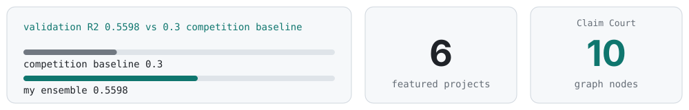
</picture>

<picture>
  <source media="(prefers-color-scheme: dark)" srcset="assets/divider-dark.svg">
  
</picture>

## Architecture

<picture>
  <source media="(prefers-color-scheme: dark)" srcset="assets/stack-dark.svg">
  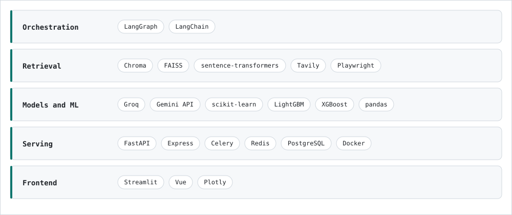
</picture>

<picture>
  <source media="(prefers-color-scheme: dark)" srcset="assets/divider-dark.svg">
  
</picture>

## Evaluated Work

<a href="https://github.com/24f2000777/claim-court">
<picture>
<source media="(prefers-color-scheme: dark)" srcset="assets/cards/claim-court-dark.svg">
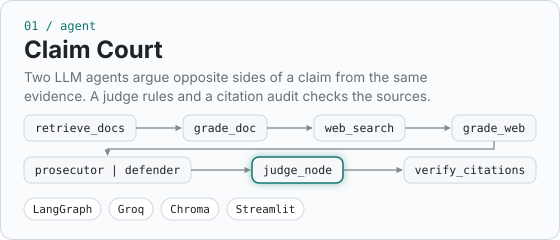
</picture>
</a>
<a href="https://github.com/24f2000777/llm-quiz-solver">
<picture>
<source media="(prefers-color-scheme: dark)" srcset="assets/cards/llm-quiz-solver-dark.svg">
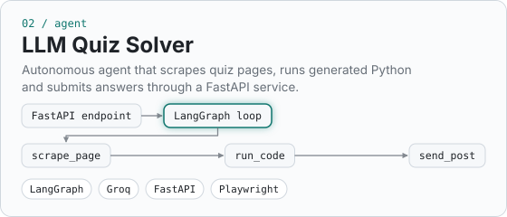
</picture>
</a>
<a href="https://github.com/24f2000777/llm-code-deployment">
<picture>
<source media="(prefers-color-scheme: dark)" srcset="assets/cards/llm-code-deployment-dark.svg">
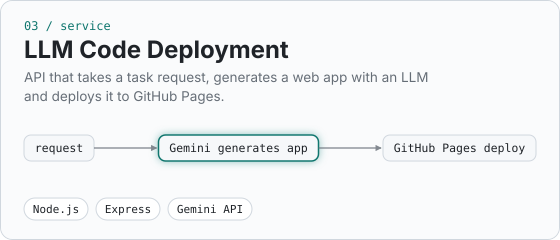
</picture>
</a>
<a href="https://github.com/24f2000777/cinema-audience-forecasting">
<picture>
<source media="(prefers-color-scheme: dark)" srcset="assets/cards/cinema-audience-forecasting-dark.svg">
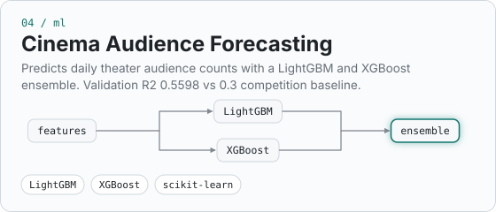
</picture>
</a>
<a href="https://github.com/24f2000777/MAY2026-Team-059">
<picture>
<source media="(prefers-color-scheme: dark)" srcset="assets/cards/nagrik-ai-dark.svg">
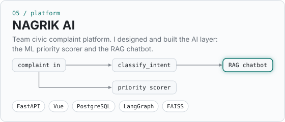
</picture>
</a>
<a href="https://github.com/24f2000777/Churn_Dashboard">
<picture>
<source media="(prefers-color-scheme: dark)" srcset="assets/cards/churn-dashboard-dark.svg">
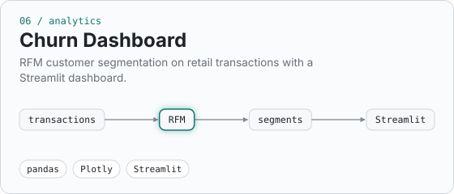
</picture>
</a>

Claim Court: how it works

 

`retrieve_docs` searches the document in Chroma and `grade_doc` grades each passage. 
`web_search` runs two Tavily searches, one for support and one for contradiction, and `grade_web` scores the evidence. Weak evidence goes to `rewrite` and the search is retried. 
`prosecutor` and `defender` run in parallel, then the graph pauses so a human can review both cases before `judge_node`. 
`judge_node` returns supported, disputed or unsupported, and `verify_citations` checks each citation against the evidence it points to. 
State is saved in a SQLite checkpointer, so trials can be resumed.

LLM Quiz Solver: how it works

 

A FastAPI endpoint receives a quiz URL, checks a shared secret and starts the agent in the background. 
The agent is a LangGraph loop between a Groq model and four tools: `scrape_page` (Playwright), `install_package`, `run_code` and `send_post`. 
The model scrapes the page, writes and runs Python to answer the questions, and submits the answers. 
If the server's response includes another quiz URL, the agent solves that one next. Otherwise it stops.

NAGRIK AI: how my part works

 

The chatbot is a LangGraph conversation graph. `classify_intent` routes each message to a handler for filing a complaint, answering a location or photo follow-up, answering a question, app help or small talk. 
Complaint details are extracted into a structured schema by a Groq model, with Gemini and Hugging Face providers available as fallbacks. 
Questions about city rules are answered from a FAISS index of BMC documents (OCR, text splitting, MiniLM embeddings), retrieving the top 5 chunks. 
The priority scorer is a scikit-learn `HistGradientBoostingRegressor` served through a FastAPI endpoint. It is trained on a BMC complaints dataset using a priority formula I wrote, because the data has no priority label.

<picture>
  <source media="(prefers-color-scheme: dark)" srcset="assets/divider-dark.svg">
  
</picture>

## Agent Trace

Illustrative trace. The claim is made up for the example.

<picture>
  <source media="(prefers-color-scheme: dark)" srcset="assets/trace-dark.svg">
  
</picture>

<picture>
  <source media="(prefers-color-scheme: dark)" srcset="assets/divider-dark.svg">
  
</picture>

## Currently Training

<picture>
  <source media="(prefers-color-scheme: dark)" srcset="assets/training-dark.svg">
  
</picture>

## Limitations and Honest Notes

- Still learning FastAPI async patterns, PostgreSQL and evaluation methodology.
- The NAGRIK priority scorer learns a formula I defined, so it approximates that formula and is not trained on real outcomes.
- Claim Court's evaluation set is small (12 claims). Building a larger one is on my roadmap.

## Contact

[LinkedIn](https://www.linkedin.com/in/akshitgarg-ds) | [akshitgarg928@gmail.com](mailto:akshitgarg928@gmail.com)
